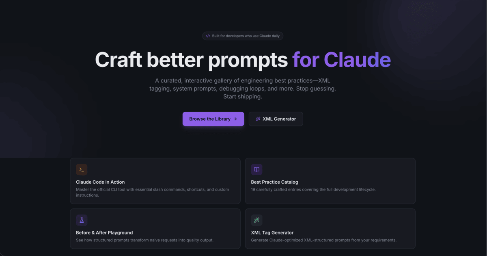

# ClaudeCraft ⚡️



> **A curated, interactive gallery of best practices for prompting and collaborating with Claude for software engineering.**

ClaudeCraft is an interactive web application designed to help developers write better prompts, understand AI-assisted software engineering workflows, and generate properly structured XML prompts for the Anthropic Claude model.

## ✨ Features

- 📚 **Best Practice Library**: Browse through categorized best practices for prompt engineering, code review, project context, and iterative debugging.
- 🧪 **Interactive Playground**: A split-screen environment that compares naive, unstructured prompts to optimized, Claude-friendly prompts, complete with reasoning and results.
- 🛠️ **XML Tag Generator**: The highest-impact prompting technique made easy. A specialized tool to wrap your Context, Instructions, Examples, Constraints, and Tasks in Claude-native XML boundaries.
- 💻 **Claude Code in Action**: A comprehensive guide for utilizing Anthropic's new CLI agent `claude-code`, including exhaustive slash commands, `.claudecode` examples, and keyboard shortcuts.
- 🌓 **Dark/Light Mode**: First-class dark mode support, built on top of a terminal-inspired, clean UI.
- 📋 **Seamless Snippet Copying**: Instant one-click copy functionality on all prompt examples.

## 🚀 Tech Stack

- **Framework**: [Next.js 14](https://nextjs.org/) (App Router)
- **Language**: TypeScript
- **Styling**: [Tailwind CSS](https://tailwindcss.com/)
- **Components**: UI heavily inspired by/using [shadcn/ui](https://ui.shadcn.com/)
- **Icons**: [Lucide React](https://lucide.dev/)
- **Syntax Highlighting**: Custom styled `shiki`

## 📦 Getting Started

### Prerequisites

Ensure you have Node.js and `pnpm` (or `npm`/`yarn`) installed on your local machine.

### Installation

1. **Clone the repository:**

   ```bash
   git clone https://github.com/awixor/ClaudeCraft.git
   cd ClaudeCraft
   ```

2. **Install dependencies:**

   ```bash
   pnpm install
   ```

3. **Run the development server:**

   ```bash
   pnpm dev
   ```

4. Open [http://localhost:3000](http://localhost:3000) with your browser to see the result.

## 📂 Project Structure

- `/app`: Next.js App Router endpoints (`/library`, `/playground`, `/xml-generator`, etc.)
- `/components`: Reusable React components (`CodeBlock`, `Navigation`, `XmlGenerator`, etc.)
- `/data`: Static data serving as the knowledge layer for the application (`practices.ts`, `claudeCode.ts`, `playground.ts`)

## 🤝 Contributing

Contributions are welcome! If you have a solid prompt engineering technique or a useful snippet for Claude or `claude-code`, feel free to open a Pull Request modifying the data entries inside the `/data` folder.

## 📄 License

This project is licensed under the MIT License.
